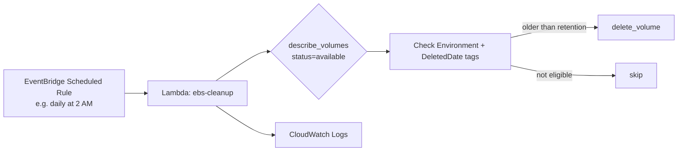

# Final Project — EBS Volume Cleanup Lambda

[Home](../README.md) | [1. Basics](../case1-python-basics/README.md) | [2. Intermediate](../case2-intermediate/README.md) | [3. AWS boto3](../case3-aws-boto3/README.md) | **Final Project**

**Scenario:** When an EC2 instance is terminated, EBS volumes that don't have
"delete on termination" set are left behind in the `available` (unattached) state,
silently costing money forever. This Lambda finds those orphaned volumes and deletes
them once they've been sitting around longer than your retention policy:

- **prod** → keep for **30 days** after the instance was deleted (grace period, in
  case someone needs to recover data)
- **dev** → keep for **7 days** (dev resources should get cleaned up fast)

Environment and age are both determined from **tags** — no hardcoded volume IDs.

## Tagging strategy (the important design decision)

The Lambda relies on two tags being present on each EBS volume:

| Tag | Example | Meaning |
|-----|---------|---------|
| `Environment` | `prod` / `dev` | Which retention rule applies |
| `DeletedDate` | `2026-07-01` | The date the parent EC2 instance was terminated |

**Assumption / trade-off to mention in your interview:** AWS doesn't natively track
"when did this volume become unattached". So either:
1. Your termination automation (or an EventBridge rule on `EC2 Instance Terminate`)
   stamps the volume with a `DeletedDate` tag at termination time, **or**
2. You look this up after the fact via CloudTrail (`DetachVolume`/`TerminateInstances`
   events) — more accurate, but adds complexity and CloudTrail lookup cost.

This project uses option 1 for simplicity — it's the realistic, common pattern used
in most orgs (tag-on-termination via a Lambda triggered from an EventBridge rule, or
tags copied from the instance onto its volumes at creation time).

## Architecture



## Files

- [lambda_function.py](lambda_function.py) — the Lambda handler + all logic
- [requirements.txt](requirements.txt) — only needed for local dev; `boto3` ships
  built into the Lambda runtime already

## Environment variables (configured on the Lambda, not hardcoded)

| Variable | Default | Purpose |
|----------|---------|---------|
| `PROD_RETENTION_DAYS` | `30` | Days to keep prod volumes after deletion |
| `DEV_RETENTION_DAYS` | `7` | Days to keep dev volumes after deletion |
| `DRY_RUN` | `true` | When `true`, logs what *would* be deleted but takes no action |

Always deploy with `DRY_RUN=true` first, check the CloudWatch logs for a few days,
then flip it to `false`. This is a standard, low-risk rollout pattern for anything
destructive — a good thing to call out in an interview.

## Code walkthrough

1. **`get_stale_volumes()`** — uses a **paginator** on `describe_volumes` (filtered
   server-side to `status=available`) so it works correctly even with thousands of
   volumes, not just the first page.
2. **`tags_to_dict()`** — AWS returns tags as a list of `{Key, Value}` dicts; convert
   to a normal dict for easy `.get()` lookups.
3. **`is_eligible_for_cleanup()`** — pulls `Environment` + `DeletedDate`, computes age
   with `datetime`/`timedelta` math, compares against `RETENTION_DAYS`. Returns
   `(False, None)` safely if tags are missing/malformed — **never crash on bad
   input, just skip and log it**.
4. **`delete_volume()`** — wraps `ec2.delete_volume` in `try/except ClientError` so
   one bad volume (e.g. already deleted by someone else) doesn't crash the whole run.
5. **`lambda_handler()`** — the entry point AWS Lambda calls. Loops through
   candidates, respects `DRY_RUN`, and returns a summary dict (useful for logs/alerts
   and for local testing assertions).

## Required IAM permissions (least privilege)

```json
{
  "Version": "2012-10-17",
  "Statement": [
    {
      "Effect": "Allow",
      "Action": [
        "ec2:DescribeVolumes",
        "ec2:DeleteVolume"
      ],
      "Resource": "*"
    },
    {
      "Effect": "Allow",
      "Action": [
        "logs:CreateLogGroup",
        "logs:CreateLogStream",
        "logs:PutLogEvents"
      ],
      "Resource": "arn:aws:logs:*:*:*"
    }
  ]
}
```
The Lambda authenticates via its **execution role** — never hardcode AWS keys in the
code or environment variables.

## Testing locally

```bash
pip install -r requirements.txt
aws configure                 # so boto3 can find real (or sandbox) credentials
DRY_RUN=true python lambda_function.py
```
The `if __name__ == "__main__":` block at the bottom calls `lambda_handler({}, None)`
directly, so you can run and debug it exactly like a normal script before ever
touching the Lambda console.

## Deploying

1. Zip it: `zip function.zip lambda_function.py`
2. Create the Lambda (Python 3.12 runtime), attach the IAM role above.
3. Set environment variables (`DRY_RUN=true` to start).
4. Add an **EventBridge (CloudWatch Events) rule** with a schedule expression like
   `rate(1 day)` targeting this Lambda.
5. Watch CloudWatch Logs for a few runs, confirm the "eligible" list looks right,
   then set `DRY_RUN=false`.

## Talking points for the interview

- Why **tags** instead of hardcoded IDs → automation must be generic and safe as
  infrastructure changes.
- Why **dry-run mode** → never deploy anything destructive without a safe rollout path.
- Why a **paginator** → `describe_volumes` truncates results; not using one is a
  common bug that silently misses volumes.
- Why **per-environment retention** → prod needs a longer recovery window than dev.
- Could extend it to **snapshot before delete** for extra safety, or publish an
  **SNS notification** summarizing what was deleted — good "what would you improve"
  answer if asked.
- Error handling philosophy: skip and log bad/missing tags rather than crashing the
  whole batch — one bad resource shouldn't block cleanup of everything else.
